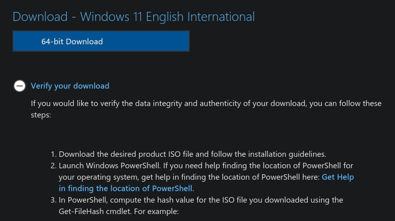
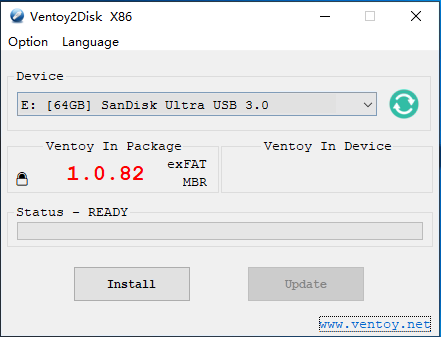
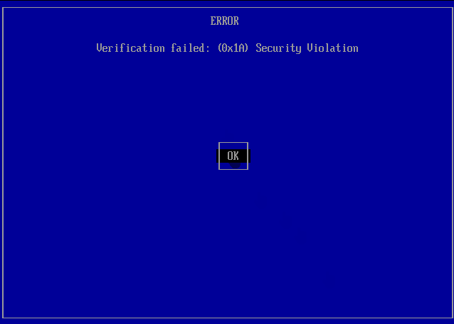

# Clean Windows Install Guide for Enhanced Privacy and Security

### ⚠️ Caution: Not for extremely high-risk scenarios

While this guide significantly enhances Windows privacy and security, it's not suitable for everyone. Windows remains a frequent target for malware and targeted attacks due to its popularity and closed-source code. If you are in a situation where the stakes are exceptionally high, a few examples below, even a hardened Windows system may not be sufficient:
- You are an activist, investigative journalist, or whistleblower,
- You are a dissident facing targeted surveillance by state actors or sophisticated cyberattacks,
- You are working in extremely sensitive fields, like nuclear, energy or healthcare,
- You are working in government, military and/or intelligence agencies.

For extreme threat models, consider alternative operating systems like [Qubes OS](https://www.qubes-os.org/doc/installation-guide/) and [TAILS](https://tails.net/index.en.html) instead. __Please exercise caution and do your own research before making any decisions regarding your security.__ If you are in government/military, please ask for your organization's protocols if available.

## Initialization

### Prerequisites
- __System Requirements:__ Refer to Microsoft's official documentation for [Windows 11](https://www.microsoft.com/en-us/windows/windows-11-specifications?r=1#table1) and [Windows 10](https://www.microsoft.com/en-us/windows/windows-10-specifications#primaryR2).
- __Network Drivers:__ You might want to download the latest network drivers from your PC manufacturer's support website before reinstalling. If multiple latest available drivers are available, download all of them.
- A 8GB or larger __USB stick__.

### Starting
#### 1. Get a Windows ISO
Download the ISO file of your desired Windows version (preferably the English International build) from a trusted source listed below:
- Windows 11 (x64): https://www.microsoft.com/en-us/software-download/windows11
- Windows 10 (x86 or x64): https://www.microsoft.com/en-us/software-download/windows10ISO

The following sources are only recommended if you know what you are doing:
- Windows ARM: https://massgrave.dev/windows_arm_links
- Windows 11 (ARM, build ISO manually): https://uupdump.net/fetchupd.php?arch=arm64&ring=retail
- Windows 10 (ARM, build ISO manually): https://uupdump.net/known.php?q=19045&arch=arm64&ring=retail
- Windows LTSC: https://massgrave.dev/windows_ltsc_links

#### 2. Verify the Download
After downloading, please check the SHA256 hash of the ISO against Microsoft's published values to ensure the file hasn't been corrupted or altered.

In PowerShell, type the following command:
`Get-FileHash C:\path\to\Downloads\<FileName>.iso`

The result should match the hash provided by Microsoft from the "Verify your Download" section. The list is at under the download button. 

#### 3. Get network drivers
Windows might not automatically install your network drivers during a clean install by default, meaning your computer would be left without a network connection. Thus, it's best to have them ready beforehand on a USB drive. (You can put it on the USB for installation later on step 2.3.)

#### 4. Make a Ventoy USB

Download the latest release of Ventoy [from here](https://github.com/ventoy/Ventoy/releases) and extract it wherever you feel comfortable. Assuming you are using Windows, run Ventoy2Disk.exe in the folder. Otherwise, [follow this guide](https://www.ventoy.net/en/doc_start.html).

In the opened window, select your USB drive and click Install and wait until it's done. Copy the downloaded ISO file into the USB drive (now labeled Ventoy).

## Reinstall Windows
Disconnect internet from your PC (including all ethernet cables or USB tethering), and do not reconnect to the internet until further instructions.

Now, restart your computer and boot from the USB drive using the BIOS menu.

✱ At this point, if you encounter a “Security Violation” Secure Boot error, like so, then enroll the key:

At the Ventoy boot menu, select the Windows ISO using the arrow keys, press Enter, click Boot in normal mode, and press Enter again. Follow [Microsoft's reinstallation guide](https://support.microsoft.com/en-us/windows/reinstall-windows-d8369486-3e33-7d9c-dccc-859e2b022fc7#ID0EDBBBBBBBDBD) from step 4 (clicking Install now) onwards.

### Initial setup
#### For Windows 11:
Go through the setup as normal, just make sure to:
- Not connect to the internet
- Deny all options in the Privacy screen

#### For Windows 10:
Go through the setup as normal, but:
- Click __I don't have internet__ when prompted to connect to the internet.
- Click __Continue with limited setup__ or __Domain join__ after the Internet section
- Deny all options in the Privacy screen
- Do not accept Cortana

## Optimizing new Windows installation
Only now should internet connection be enabled. Connect your device to the internet and continue.

### 1. Chris Titus Tech's Windows Utility
This utility is a compilation of Windows tasks by Chris Titus to streamline installs, debloat with tweaks, troubleshoot with config, and fix Windows updates. See the [GitHub repository](https://github.com/ChrisTitusTech/winutil) for documentation.

To use, open Terminal or PowerShell as Admin and run the following command:
`irm "https://christitus.com/win" | iex`

If the site is unreachable, try fetching the script directly from GitHub:
`irm "https://github.com/ChrisTitusTech/winutil/releases/latest/download/winutil.ps1" | iex`

From there, choose the applications you need, install all, and head to the Tweaks tab. Here, you will find a bunch of tweaks that enhance both performance and privacy. However, I'm only going to list settings related to privacy here. You should enable:

- All essential tweaks
- Remove OneDrive (unless you use it)
- Turn off Bing Search in Start menu
- Enable Show file extensions
- Disable Taskbar widgets
- Disable Search box web suggestions in registry

### 2. O&O ShutUp
- If you haven't already ran O&O ShutUp from Chris's tool, download O&O ShutUp [from here](https://dl5.oo-software.com/files/ooshutup10/OOSU10.exe) and run it as Administrator.
- Apply all recommended settings by going to Actions > Recommended and somewhat recommended settings.
- Uncheck the following (toggle to red) for functionality:
	- Privacy: "Disable app notifications" (if you don’t need notifications, leave enabled),
	- App Privacy: "Disable app access" to documents, images, videos, file system, and any other functionality that you use. Camera and microphone should only be turned on when you use them, so unless you frequently use them, leave app access disabled.

### 3. Microsoft Office
If you need to get Office, be sure to download it from reputable sources.

The download links below are for Office 365 Pro Plus, original from Microsoft:
- Online installer: https://c2rsetup.officeapps.live.com/c2r/download.aspx?ProductreleaseID=O365ProPlusRetail&platform=x64&language=en-us&version=O16GA
- Offline installer: https://officecdn.microsoft.com/db/492350f6-3a01-4f97-b9c0-c7c6ddf67d60/media/en-us/O365ProPlusRetail.img

Instructions:
- Online installer: Open the downloaded executable and follow the on-screen instructions. You mostly won’t need to do anything, as it is Click-to-Run.
- Offline installer: After downloading the image, either mount it or extract it to a folder of your choice. Then, open the folder in Terminal or Command Prompt, type in the following command: `setup.exe /download Configuration.xml` and let the setup do its job.

## Finishing
And there you have it! You've successfully hardened your Windows installation for enhanced privacy.

While not foolproof, the steps you've taken significantly reduce the data Microsoft and other third parties can collect about you. However, privacy is still an ongoing struggle, so stay informed about new threats and privacy concerns.

Remember, this guide offers only a baseline for privacy. For those facing significant threats or seeking absolute anonymity, I still highly recommend exploring alternative operating systems like Qubes OS or TAILS. These specialized systems are designed to prioritize security and privacy above all else, offering a level of protection Windows simply cannot match.
